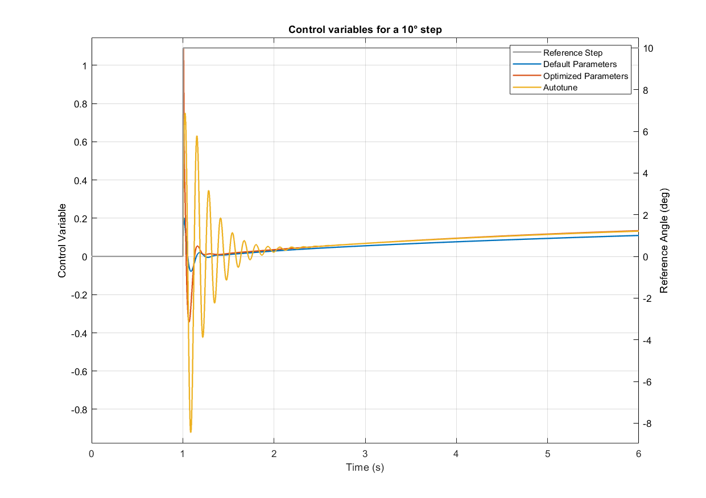
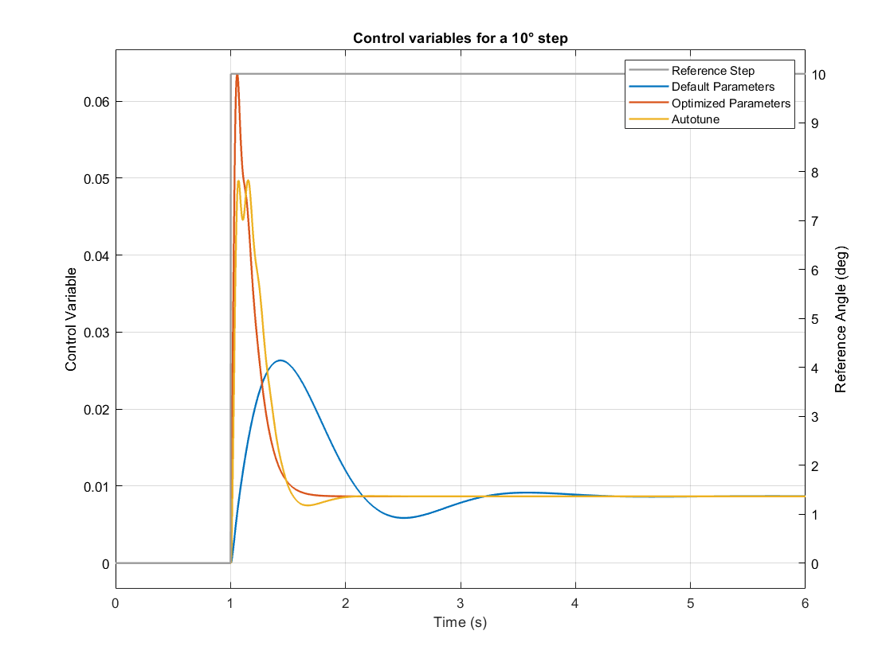

Flight Controller Optimization
==============================

Now that a model for the Quadcopter is available from System ID Mode <systemid-mode-operation>, the flight controller is optimized using a multi-objective optimization. 
Since the model is linear, a control optimization tool for linear system analysis in MATLAB is applied. 
In order to make the controller parameters adjustable by the optimization algorithm, the flight controller for the Stabilize mode has been modelled in MATLAB.
The following remarks regarding the optimization goals and results are **only valid for the examined quadcopter** with a weight of 1.5 kg, an arm length of 22 cm and 9 inch propellers. 
The resulting parameters are specifically applicable for this copter configuration and **should not** be used for any other copter.

Optimization Goals
------------------

The following table shows the goals of the controller optimization.
The dynamics of the roll and pitch axes are very similar. 
Therefore, identicial goal are applied to both axes.
The yaw axis behaves quite differently. 
It is assumed that disturbances due to translational motion and wind mainly influence the pitch and roll axes.
Because of this, the disturbance rejection is not optimized for the yaw axis.

+------------------------------------+-----------------+---------------+----------------------+
| Goal                               | Pitch & Roll    | Yaw           | Optimization Target  |
+------------------------------------+-----------------+---------------+----------------------+
| Phase Margin                       | 30°             | 30°           | Larger is better     |
+------------------------------------+-----------------+---------------+----------------------+
| Gain Margin                        | 5 dB            | 5 dB          | Larger is better     |
+------------------------------------+-----------------+---------------+----------------------+
| Step Response: Response Time       | 0.02 s          | 0.2s          | Smaller is better    |
+------------------------------------+-----------------+---------------+----------------------+
| Step Response: Overshoot           | 5 %             | 5 %           | Smaller is better    |
+------------------------------------+-----------------+---------------+----------------------+
| Step Response: Stationary Error    | 5 %             | 0.1 %         | Smaller is better    |
+------------------------------------+-----------------+---------------+----------------------+
| Control Variable Max. Overshoot    | 80 %            | 10 %          | Smaller is better    |
+------------------------------------+-----------------+---------------+----------------------+
| Disturbance Rejection              | see graph below |not applied    | Smaller is better    |
+------------------------------------+-----------------+---------------+----------------------+

The frequency-based disturbance rejection in decibel is shown below.
As a reference, the blue line represents the rejection gain that is achieved with the default parameters of ArduCopter.

:name: fig-dist-reject-req

Optimization Results in the Simulation
--------------------------------------

The following two tables shows the optimized flight controller parameters for the roll and yaw axis compared to the default parameters of ArduCopter.
The defaults are also used as initial parameters for the optimization.
As a reference, parameters obtained from the Autotune flight mode are also shown.
It shows that the optimized parameters differ greatly from the default and Autotune parameters.

Roll:

+--------------------------------+-----------------------+----------------------+------------------------+
| Parameter                      | Default               | Optimized            | Autotune               |
+--------------------------------+-----------------------+----------------------+------------------------+
| ATC_RAT_RLL_P                  | 0.1350                | 0.1496               | 0.240025               |
+--------------------------------+-----------------------+----------------------+------------------------+
| ATC_RAT_RLL_I                  | 0.1350                | 0.8                  | 0.240025               |
+--------------------------------+-----------------------+----------------------+------------------------+
| ATC_RAT_RLL_D                  | 0.0036                | 0.0046               | 0.007948               |
+--------------------------------+-----------------------+----------------------+------------------------+
| ATC_RAT_RLL_FF                 | 0                     | 0.007                | 0                      |
+--------------------------------+-----------------------+----------------------+------------------------+
| ATC_RAT_RLL_FLTT               | 23.0000               | 83.1821              | 5.0                    |
+--------------------------------+-----------------------+----------------------+------------------------+
| ATC_RAT_RLL_FLTD               | 23.0000               | 47.8274              | 23.0                   |
+--------------------------------+-----------------------+----------------------+------------------------+
| ATC_RAT_RLL_FLTE               | 0                     | 0                    | 0                      |
+--------------------------------+-----------------------+----------------------+------------------------+
| ATC_ANG_RLL_P                  | 4.5                   | 10.6095              | 16.670347              |
+--------------------------------+-----------------------+----------------------+------------------------+

Yaw:

+--------------------------------+-----------------------+----------------------+------------------------+
| Parameter                      | Default               | Optimized            | Autotune               |
+--------------------------------+-----------------------+----------------------+------------------------+
| ATC_RAT_YAW_P                  | 0.18                  | 0.0013               | 0.894938               |
+--------------------------------+-----------------------+----------------------+------------------------+
| ATC_RAT_YAW_I                  | 0.018                 | 0                    | 0.089494               |
+--------------------------------+-----------------------+----------------------+------------------------+
| ATC_RAT_YAW_D                  | 0                     | 0.041                | 0                      |
+--------------------------------+-----------------------+----------------------+------------------------+
| ATC_RAT_YAW_FF                 | 0                     | 0.0183               | 0                      |
+--------------------------------+-----------------------+----------------------+------------------------+
| ATC_RAT_YAW_FLTT               | 23.0000               | 0                    | 23.0                   |
+--------------------------------+-----------------------+----------------------+------------------------+
| ATC_RAT_YAW_FLTD               | 0                     | 2.25                 | 23.0                   |
+--------------------------------+-----------------------+----------------------+------------------------+
| ATC_RAT_YAW_FLTE               | 0                     | 0                    | 3                      |
+--------------------------------+-----------------------+----------------------+------------------------+
| ATC_ANG_YAW_P                  | 4.5                   | 19.6323              | 7.599                  |
+--------------------------------+-----------------------+----------------------+------------------------+

The next three plots show the simulation results for the tracking behaviour of a 10 degree step, the control variable corresponding to the angle step and the disturbance behaviour for the roll axis.
The control variable is shown to evaluate whether the optimized behaviour can actually be realized by the real system.
It is assumed that the disturbances act as external torques on the airframe.
Therefore, the disturbance behaviour is simulated as a step on the control variables.

Tracking Behaviour:

.. image:: ../images/rollAxisTrackingSim.png
:name: fig-track-roll-sim

Control Variables:

:name: fig-ctrlvar-roll-sim

Disturbance Behaviour:

.. image:: ../images/rollAxisDisturbanceSim.png
:name: fig-dist-roll-sim

In general, all figures show that the optimized parameters and the parameters obtained from Autotune lead to a much better controller performance.
The first :ref:`figure<fig-track-roll-sim>` shows that the tracking behaviour of the optimized parameterization is the fastest and does produce less overshoot than the other two controller variants.
This is achieved by a sharp rise in the control variable, as depicted in the second :ref:`figure<fig-ctrlvar-roll-sim>`. 
Though, compared to Autotune, the control variable does not oscillate as much and decreases faster.
This behaviour is easier to realize by the motors.
Also, heavier oscillations in the control variables lead to more produces heat by the ESCs.
Disturbances lead to a larger system response for the optimized parameterization compared to Autotune, as can be seen in the third :ref:`plot<fig-dist-roll-sim>`.
Though, the rejection happens much faster.
After two seconds, the copter has returned to the hover state.

The next plots show the results for the yaw axis.
Only the tracking behaviour is shown as the disturbance rejection was not optimized.

Tracking Behaviour:

.. image:: ../images/yawAxisTrackingSim.png
:name: fig-track-yaw-sim

Control Variables:

:name: fig-ctrlvar-yaw-sim

The :ref:`tracking behaviour<fig-track-yaw-sim>` is clearly improved by the optimization.
It is faster than the controller parameterized by Autotune and does not produce any overshoot.
Again, as the second :ref:`figure<fig-ctrlvar-yaw-sim>` illustrates, this is caused by a larger control variable.
Though, its value stays in a acceptable range and is likely to be realizable in real flight.

For a more precise evaluation of the performance, the following metrics from classic control theory are used:

+----------------------------------------+------------------------------------------------------------------------+-----------------------------------+
| Criteria                               | Description                                                            | Qualitive Target                  |
+----------------------------------------+------------------------------------------------------------------------+-----------------------------------+
| **Gain Margin**                        | Amplitude gain reserve that can still be applied                       |                                   |
|                                        | at a phase shift of -180° without the system losing                    | Larger is better                  |
|                                        | stability. Needs to be positive for the system to be stable.           |                                   |
+----------------------------------------+------------------------------------------------------------------------+-----------------------------------+
| **Phase Margin**                       | Phase shift reserve at an amplitude gain of 0 dB.                      |                                   |
|                                        | Needs to be positive for the system to be stable.                      | Larger is better                  |
+----------------------------------------+------------------------------------------------------------------------+-----------------------------------+
| **Tracking Rise Time**                 | Time that the system response needs to go from 10% to 90%              |                                   |
|                                        | of the final step value.                                               | Smaller is better                 |
+----------------------------------------+------------------------------------------------------------------------+-----------------------------------+
| **Tracking Overshoot**                 | Exceedance of the final step value expressed in percentage             |                                   |
|                                        | of the desired step height.                                            | Smaller is better                 |
+----------------------------------------+------------------------------------------------------------------------+-----------------------------------+
| **Tracking Settling Time**             | Point of time after which the system response stays in 2% error band   |                                   |
|                                        | around the final step value.                                           | Smaller is better                 |
+----------------------------------------+------------------------------------------------------------------------+-----------------------------------+
| **Disturbance Rejection Overshoot**    | Exceedance of zero (= no system response to disturbance) expressed     |                                   |
|                                        | in percentage of the disturbance step height.                          | Smaller is better                 |
+----------------------------------------+------------------------------------------------------------------------+-----------------------------------+
| **Disturbance Rejection Settling Time**| Point of time after which the system response stays in 2% error        |                                   |
|                                        | band around stationary state (= 0).                                    | Smaller is better                 |
+----------------------------------------+------------------------------------------------------------------------+-----------------------------------+

The following table shows these metrics for all three controller variations for the roll axis.
It shows that the default parameterization has the highest gain and phase margin due to its slow controller.
All other criteria of the default parameters confirm the bad performance seen in the plots above.
The last for metrics could not be computed since the controller is not able to reach the final step value for the tracking or to make the copter return to steady state in case of an disturbance respectively.
The optimized controller still has very high gain and phase margins compared to the Autotune controller.
It also produces a low tracking overshoot and is able to reach the 2% error band of the desired step value very quick.
The Autotune controller shows a slightly faster rising time.
The metrics for the disturbance rejection also reflect the plotted results above.
While the overshoot of the Autotune is lower by a fair bit, the optimized controller only needs about halve the time to compensate the disturbance.

+----------------------------------------+-----------+-----------+----------+
| Criteria                               | Default   | Optimized | Autotune |
+----------------------------------------+-----------+-----------+----------+
| Gain Margin (dB)                       | 13.9570   | 7.2258    | 1.9215   |
+----------------------------------------+-----------+-----------+----------+
| Phase Margin (deg)                     | 79.3563   | 67.1429   | 50.2712  |
+----------------------------------------+-----------+-----------+----------+
| Tracking Rise Time (s)                 | 8.3465    |	0.0687   | 0.0472   |
+----------------------------------------+-----------+-----------+----------+
| Tracking Overshoot (%)                 | 0.0000    | 3.8430    | 27.4629  |
+----------------------------------------+-----------+-----------+----------+
| Tracking Settling Time (s)             | n.a.      | 3.2720    | 7.6679   |
+----------------------------------------+-----------+-----------+----------+
| Disturbance Rejection Overshoot (%)    | 110.0415  | 45.4958   | 29.4360  |
+----------------------------------------+-----------+-----------+----------+
| Disturbance Rejection Settling Time (s)| n.a.      |	1.7150   | 3.4575   |
+----------------------------------------+-----------+-----------+----------+

The next table contains the metrics for the yaw axis.
Again, the default controller shows the highest gain margin followed by the optimized parameterization and the Autotune controller with the lowest margins.
Contrary to the roll axis, the optimized controller has the highest phase margin.
Regarding the tracking behaviour, the Autotune controller has a slightly shorter rise time.
The optimized parameterization has no tracking overshoot at all und needs less time to reach the 2% error band of the final step value, as it was already the case for the roll axis.

+-----------------------------+----------+-----------+----------+
| Criteria                    | Default  | Optimized | Autotune |
+-----------------------------+----------+-----------+----------+
| Gain Margin (dB)            | 25.9180	 | 11.3688   | 2.3542   |
+-----------------------------+----------+-----------+----------+
| Phase Margin (deg)          | 13.2705	 | 59.8237   | 7.9728   |
+-----------------------------+----------+-----------+----------+
| Tracking Rise Time (s)      | 0.4656	 | 0.2136    | 0.2097   |
+-----------------------------+----------+-----------+----------+
| Tracking Overshoot (%)      | 17.1561  | 0.0000    | 3.9608   |
+-----------------------------+----------+-----------+----------+
| Tracking Settling Time (s)  | 3.2548	 | 1.4168    | 1.6474   |
+-----------------------------+----------+-----------+----------+
