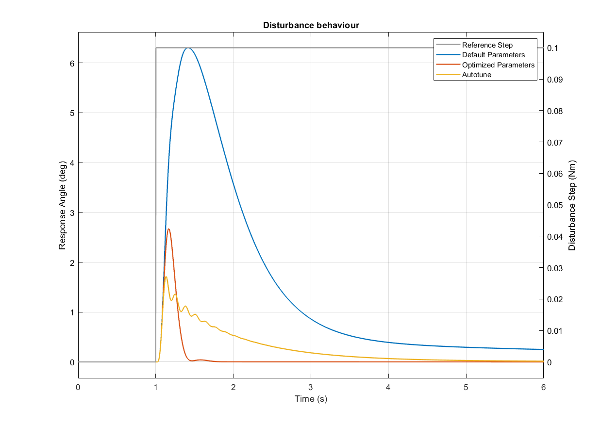

Flight Controller Optimization
==============================

Now that a model for the Quadcopter is available, the flight controller is optimized using a multi-objective optimization. 
Since the model is linear, a control optimization tool for linear system analysis in MATLAB is applied. 
In order to make the controller parameters adjustable by the optimization algorithm, the flight controller for the Stabilize mode has been modelled in MATLAB.

Optimization Goals
------------------

The following table shows the goals of the controller optimization.
The dynamics of the roll and pitch axes are very similar. 
Therefore, identicial goal are applied to both axes.
The yaw axis behaves quite differently. 
It is assumed that disturbances due to translational motion and wind mainly influence the pitch and roll axes.
Because of this, the disturbance rejection is not optimized for the yaw axis.

+------------------------------------+-----------------+---------------+----------------------+
| Goal                               | Pitch & Roll    | Yaw           | Optimization Target  |
+------------------------------------+-----------------+---------------+----------------------+
| Phase Margin                       | 30°             | 30°           | Larger is better     |
+------------------------------------+-----------------+---------------+----------------------+
| Gain Margin                        | 5 dB            | 5 dB          | Larger is better     |
+------------------------------------+-----------------+---------------+----------------------+
| Step Response: Response Time       | 0.02 s          | 0.2s          | Smaller is better    |
+------------------------------------+-----------------+---------------+----------------------+
| Step Response: Overshoot           | 5 %             | 5 %           | Smaller is better    |
+------------------------------------+-----------------+---------------+----------------------+
| Step Response: Stationary Error    | 5 %             | 0.1 %         | Smaller is better    |
+------------------------------------+-----------------+---------------+----------------------+
| Control Variable Max. Overshoot    | 80 %            | 10 %          | Smaller is better    |
+------------------------------------+-----------------+---------------+----------------------+
| Disturbance Rejection              | see graph below |not applied    | Smaller is better    |
+------------------------------------+-----------------+---------------+----------------------+

The frequency-based disturbance rejection in decibel is shown below.
As a reference, the blue line represents the rejection gain that is achieved with the default parameters of ArduCopter.

.. image:: ../images/disturbanceRejectionRequirement.png
:name: fig-dist-reject-req

Optimization Results
--------------------

The following two tables shows the optimized flight controller parameters for the roll and yaw axis compared to the default parameters of ArduCopter.
The defaults are also used as initial parameters for the optimization.
As a reference, parameters obtained from the Autotune flight mode are also shown.
It shows that the optimized parameters differ greatly from the default and Autotune parameters.

Roll:

+--------------------------------+-----------------------+----------------------+------------------------+
| Parameter                      | Default               | Optimized            | Autotune               |
+--------------------------------+-----------------------+----------------------+------------------------+
| ATC_RAT_RLL_P                  | 0.1350                | 0.1496               | 0.240025               |
+--------------------------------+-----------------------+----------------------+------------------------+
| ATC_RAT_RLL_I                  | 0.1350                | 0.8                  | 0.240025               |
+--------------------------------+-----------------------+----------------------+------------------------+
| ATC_RAT_RLL_D                  | 0.0036                | 0.0046               | 0.007948               |
+--------------------------------+-----------------------+----------------------+------------------------+
| ATC_RAT_RLL_FF                 | 0                     | 0.007                | 0                      |
+--------------------------------+-----------------------+----------------------+------------------------+
| ATC_RAT_RLL_FLTT               | 23.0000               | 83.1821              | 5.0                    |
+--------------------------------+-----------------------+----------------------+------------------------+
| ATC_RAT_RLL_FLTD               | 23.0000               | 47.8274              | 23.0                   |
+--------------------------------+-----------------------+----------------------+------------------------+
| ATC_RAT_RLL_FLTE               | 0                     | 0                    | 0                      |
+--------------------------------+-----------------------+----------------------+------------------------+
| ATC_ANG_RLL_P                  | 4.5                   | 10.6095              | 16.670347              |
+--------------------------------+-----------------------+----------------------+------------------------+

Yaw:

+--------------------------------+-----------------------+----------------------+------------------------+
| Parameter                      | Default               | Optimized            | Autotune               |
+--------------------------------+-----------------------+----------------------+------------------------+
| ATC_RAT_RLL_P                  | 0.18                  | 0.0013               | 0.894938               |
+--------------------------------+-----------------------+----------------------+------------------------+
| ATC_RAT_RLL_I                  | 0.018                 | 0                    | 0.089494               |
+--------------------------------+-----------------------+----------------------+------------------------+
| ATC_RAT_RLL_D                  | 0                     | 0.041                | 0                      |
+--------------------------------+-----------------------+----------------------+------------------------+
| ATC_RAT_RLL_FF                 | 0                     | 0.0183               | 0                      |
+--------------------------------+-----------------------+----------------------+------------------------+
| ATC_RAT_RLL_FLTT               | 23.0000               | 0                    | 23.0                   |
+--------------------------------+-----------------------+----------------------+------------------------+
| ATC_RAT_RLL_FLTD               | 0                     | 2.25                 | 23.0                   |
+--------------------------------+-----------------------+----------------------+------------------------+
| ATC_RAT_RLL_FLTE               | 0                     | 0                    | 3                      |
+--------------------------------+-----------------------+----------------------+------------------------+
| ATC_ANG_RLL_P                  | 4.5                   | 19.6323              | 7.599                  |
+--------------------------------+-----------------------+----------------------+------------------------+

The next three plots show the simulation results for the tracking behaviour of a 10 degree step, the control variables corresponding to the angle step and the disturbance behaviour for the roll axis.
It is assumed that the disturbances act as external torques on the airframe.
Therefore, the disturbance behaviour is simulated as a step on the control variables.

.. image:: ../images/rollAxisTrackingSim.png
:name: fig-track-roll-sim

.. image:: ../images/rollAxisTrackingCtrlVarSim.png
:name: fig-ctrlvar-roll-sim

:name: fig-dist-roll-sim
